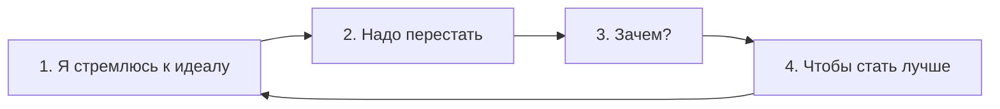
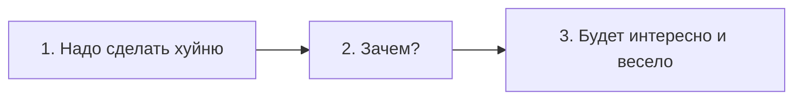
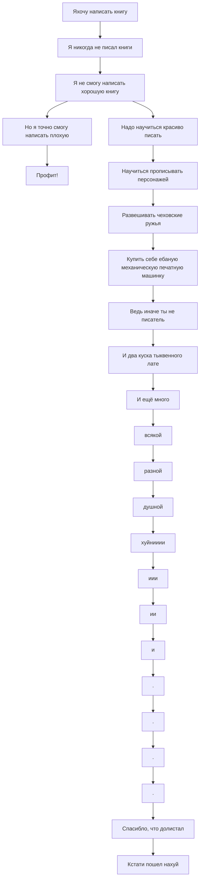

>*The Fuck Up Philosophy — a counterintuitive way to get out of a perfectionist [[rut]].
> — video from [[struthless]]*

---
Концепция восприятия любого дела, говорящая о том, что оно ***должно*** провалиться.
Данное восприятие концепция помогает избавиться от тяги к перфекционизму и нацелиться на получение удовольствия от процесса. 

Оcновой данной философии являются три мысли:
1. 

---
### Премеры

	............................. Ложное избегание перфекционизма

Если ты, чухоня, смог разобраться в этих сложных цифрах и стрелочках, то до дебя уже должно было дойти что диаграмме выше во втором пункте указан пример некорректного запроса [[—]] он изначально требует изменений в "*лучшую*" сторону.

Все *"знают"* как сделать *"хорошо"*. А для того, чтобы сделать хуйню надо постараться, как показано на диаграме выше 🤓

А эту уебанскую тягу к пЕрФеКцИоНиЗмУ возможно сломать, если нарочно делать вещи хуёвыми, чтобы достигнуть заведомо ***НАИХУЁВЕЙШЕГО!!!*** результата. 
Всё не так гротектсскно, оставлю для тебя, уебана с клиповым мышлением, простой пример:

А вот пример, который может встретиться в жизни:

Убедился, что Перфекционизм -[^1] это не твой бро???!!!

---
[^1]: ты так и не заметил, что все тире в этой доке короткие....

---
