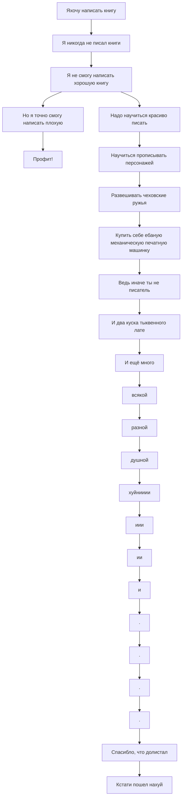

---

>*The Fuck Up Philosophy — a counterintuitive way to get out of a perfectionist [[rut]].
> — video from [[struthless]]*

---

### About

Концепция восприятия любого дела, говорящая о том, что оно ***должно*** провалиться.
Данное восприятие концепция помогает избавиться от тяги к перфекционизму и нацелиться на получение удовольствия от процесса. 

Оcновой данной философии являются три мысли:
1. Делай, а не думай
2. Не ограничивай себя
3. Получилась хуйня? Всё по плану

---

### ПОЧЕМУ *это* **полезно**???????

	............................. Ложное избегание перфекционизма

Если ты, чухоня, смог разобраться в этих сложных цифрах и стрелочках, то до дебя уже должно было дойти что диаграмме выше во втором пункте указан пример некорректного запроса [[—]] он изначально требует изменений в "*лучшую*" сторону.

Все *"знают"* как сделать *"хорошо"*. А для того, чтобы сделать хуйню надо постараться, как показано на диаграме выше 🤓 `Знаю, ничего там не показано. Я эту часть скопировал издругого раздела, котоый удалил.`

А эту уебанскую тягу к пЕрФеКцИоНиЗмУ возможно сломать, если нарочно делать вещи хуёвыми, чтобы достигнуть заведомо ***НАИХУЁВЕЙШЕГО!!!*** результата. 
Всё не так гротектсскно, оставлю для тебя, уебана с клиповым мышлением, простой пример:

А вот пример, который может встретиться в жизни:

Убедился, что Перфекционизм -[^1] это не твой бро???!!!

[^1]: ты так и не заметил, что все тире в этой доке короткие....

---

### Как применять

|   |  |  |
| ---: | --- | ---|
| **Во 1)** | Какая задача? Простыми словами | На ответ 5 секунд  |
| **2) вовторых** | какой *почти* идеальный итог? | МЕНЬШЕ ДУМАЙ |
| **в тетьих 3)** | Как именно ты хочешь зафакапить? | вступи в какашку |
| **в 4етвертых** | Пора делать хуйню | u know da wae |
| **в 5)тых** | Ачё если не получится... Чему ты будешь радовтаься? | Три причины, пять - если ты Игорь николаев |

#### снова пример на книгах

1. Хочу сделать книгу
2. Повторить успех блокбастера ["Маленький крот который хотел узнать кто ему наделал на голову"](https://encrypted-tbn0.gstatic.com/images?q=tbn:ANd9GcSoet-D4kPhsJnEcdLBiijhBFtwpwq3dYSbyFOK_22_fZJVRX5uOKC0PgXiwPk2OWJirkI&usqp=CAU)
3. Чтобы каждый читатель нашел повод для кринжа
4. Напишу книгу про фурри-нацистов в мире роблокс которые держат феменисток в твич-рабстве главная героиня(у которой умер старший отец)  восстановит **справедливость(и +6хп)** c помощью перчатки из Atomic Heart и православного креста там еще все будет как в майнкравт и АК-47
5. Если не сделаю,: поиграю в [Gravity Defied](https://i.imgur.com/GK1aWt7.png); поем читос; подрочу сырными пальцами

---

---
[^1]: ты так и не заметил, что все тире в этой доке короткие....

---
